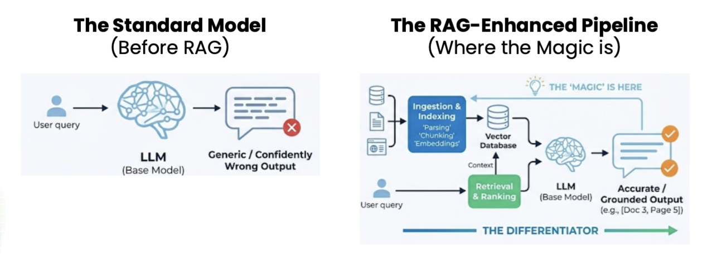

## week 1 notes

- activity --> open any AI tool (ChatGPT, Claude, Gemini etc.) and ask it something specific about a show, film, or team you know really well. It should be detailed enough that you'd catch it if it got it wrong.
    - so whether or not the LLM is right, the tone is usually going to be identical, whether its right or making something up. so you cant usually tell from the output

**building a RAG system**


---

**setup**
1. fork the [starter](https://github.com/codepath/ai201-project1-unofficial-guide-starter-v2026) repo
2. `brew install python@3.13`
3. `python3.13 -m venv newvenv`
4. `source newvenv/bin/activate`
5. `pip install -r requirements.txt`
6. [google aistudio](https://aistudio.google.com/) → sidebar → get api key (key icon)
7. add api key to `.env`
8. `python3 test.py`

    ```
    AI201 environment check
    ------------------------------------------------------------
    [PASS] Python version
            3.13.15 on Darwin
    [PASS] Virtual environment
            /Users/xxx/Downloads/ai201-project1-unofficial-guide-starter-v2026/newvenv
    [PASS] Pinned packages
            all 7 import cleanly
    [PASS] Free disk space
            345.6 GB
    [PASS] Memory
            16.0 GB
    [PASS] Key hygiene
            .env is ignored by git
    [PASS] API key
            loaded, 53 characters
    [ .. ] Embedding model — first run downloads ~80 MB, this is the slow part
    [PASS] Embedding model
            all-MiniLM-L6-v2 loaded, 384-dim vectors
    [PASS] Vector store
            Chroma round trip on a cosine collection
    [PASS] Model call
            gemini-3.5-flash-lite replied "Ready."
    ------------------------------------------------------------
    10 passed, 0 failed, 0 to look at, 0 skipped

    You're set. See you in class.
    ```

---

**milestone 1**
1. `python3 app.py index` (downloads 80 GB model)

    ```
    Corpus: campus_life

    loaded   88 documents, 27,908 characters, ~317 characters per document
    chunked  88 chunks, 317 characters on average (shortest 178, longest 549), produced by chunker.py::split_documents
    embedding 88 chunks (first run downloads the model)...
    stored   88 chunks in 8.1s

    Ready. Try: python app.py ask "your question here"
    ```

2. `python3 app.py ask "is the housing lottery random?"`

    ```
    (best distance 0.254, cutoff 0.6)

    The housing lottery is not entirely random in the way most people assume. 
    While rising sophomores get a number drawn at random, juniors and seniors are ordered first by accumulated credit hours, with random tie-breaking used only when necessary (*admin_housing_lottery.txt*).

    Sources retrieved: admin_housing_lottery.txt, admin_parking_permits.txt, advising_registration.txt, housing_morrow_house.txt, housing_tamsin_court.txt

    0 model calls this session, 1 served from cache
    ```

3. `python3 app.py --corpus advice_threads chunks -n 1`

    ```
    26 chunks total. Showing 1, spread across the corpus.

    Paste these into your README under Sample Chunks. The rubric asks
    for the source file and the function that produced them — both are
    printed for you below.

    ======================================================================
    Chunk 1  |  source: thread_bike_commute.txt#0  |  produced by: chunker.py::fallback_split
    ======================================================================
    THREAD: Is a bike worth it for a 20 minute walk commute?

    --- reply 1 (14 votes) ---
    Yeah. Cuts an 18 minute walk to about 6. The thing nobody mentions is storage — covered bike parking exists at three buildings and is full by 9am at all three.

    --- reply 2 (9 votes) ---
    Counterpoint, I sold mine. Between November and March the paths are either icy or salted and salt destroys a drivetrain in one season.

    --- reply 3 (22 votes) ---
    Both true. I keep a cheap bike for September to November and walk the rest of the year. Total cost was about $120 for the bike and I don't care what happens to it.

    --- reply 4 (5 votes) ---
    If you do get one, the campus does free registration and it's the only reason I got mine back after it was taken.

    For each one, ask: could someone answer a question using only this,
    without reading what came before or after?
    ```

4. `python3 app.py corpora`

    ```
    advice_threads
        Question-and-answer threads with several people replying and disagreeing. Uneven lengths; answers spread across replies. (23 documents)

    * campus_life
        Short posts about student life. ~88 documents of 1–3 paragraphs. Useful information usually sits in a single sentence. (88 documents)

    city_guides
        Long travel guides divided into labelled sections — nine towns and five guides that cut across them. Information is organised by heading and spread across paragraphs. (14 documents)

    practice
        Not for your project — the small corpus used for the in-class follow-along. (28 documents)

    * = current default, set in config.py (AI201_CORPUS in .env wins)
    ```

---

**milestone 2**
1. 